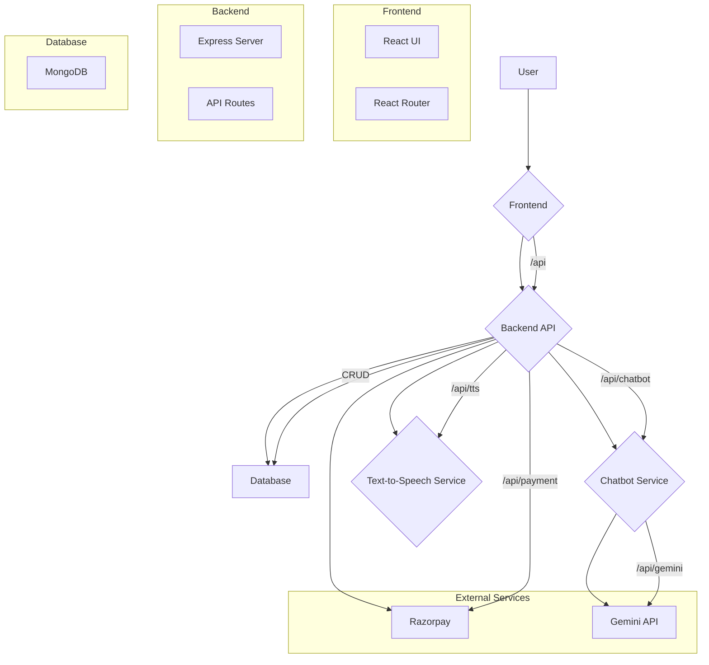

# Project Policy

Project Policy is a web application that allows users to upload their policy documents, ask questions about them using a chatbot, and get summaries of the documents. It also includes features like user authentication, payment processing, and text-to-speech for the chatbot's responses.

## Features

*   **User Authentication:** Users can sign up and log in using their email and password or through social providers like Google, GitHub, and LinkedIn.
*   **Document Upload:** Users can upload their policy documents in PDF format.
*   **Chatbot:** A chatbot powered by Google's Gemini API that can answer questions about the uploaded documents.
*   **Text-to-Speech:** The chatbot's responses can be converted to speech.
*   **Summarization:** Users can get a summary of their uploaded documents.
*   **Payments:** The application uses Razorpay to handle payments for premium features.
*   **Feedback:** Users can provide feedback on their experience with the application.

## Tech Stack

*   **Frontend:**
    *   React
    *   Vite
    *   React Router
    *   Tailwind CSS
    *   jsPDF
*   **Backend:**
    *   Node.js
    *   Express
    *   MongoDB
    *   Mongoose
    *   JSON Web Token (JWT)
    *   Passport.js (for social authentication)
    *   Razorpay
    *   PDF-Parse
*   **Microservices:**
    *   Python (for Text-to-Speech)
    *   Python (for Gemini API)


## Flow Diagram



## Getting Started

### Prerequisites

*   Node.js
*   npm
*   Python
*   pip

### Installation

1.  **Clone the repository:**
    ```bash
    git clone https://github.com/your-username/project-policy.git
    cd project-policy
    ```

2.  **Install frontend dependencies:**
    ```bash
    npm install
    ```

3.  **Install backend dependencies:**
    ```bash
    cd backend
    npm install
    ```

4.  **Install Python dependencies:**
    ```bash
    cd python-tts
    pip install -r requirements.txt
    ```

### Running the Application

1.  **Start the backend services:**
    ```bash
    cd backend
    npm start
    ```
    This will start the Node.js server, the Python text-to-speech service, and the Python Gemini service.

2.  **Start the frontend development server:**
    In a new terminal, from the root directory:
    ```bash
    npm run dev
    ```

The application will be available at `http://localhost:5173`.
