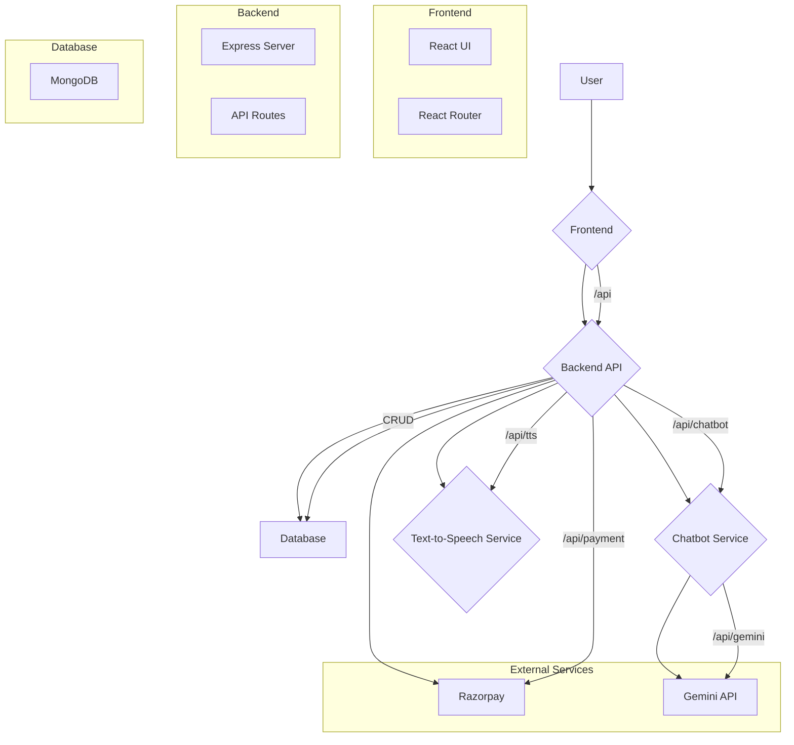

# Project Policy Summary

Project Policy is a web application that allows users to upload their policy documents, get a concise summary, and ask follow-up questions using an interactive chatbot. It includes a subscription model for premium features, multi-language support, and text-to-speech capabilities.


## Core Features

*   **Document Summarization:** Users can upload a PDF document. The system sends the document to a specialized external service that generates a summary based on the user's desired length (e.g., 200, 700, 1000 words).
*   **Interactive Chatbot:** After a summary is generated, its content is used as the context for a session-specific chatbot. Users can ask questions about the summary, allowing them to clarify points without re-reading the original document. This is a premium feature.
*   **Multi-Language Support:** Summaries can be translated into over 10 different languages using the Google Translate API. Translations for languages other than English and Hindi are a premium feature.
*   **Text-to-Speech (TTS):** Generated summaries can be converted into audio and played back in the browser. This feature is powered by a dedicated Python microservice and is available only to subscribed users.
*   **Subscription Model:** The application uses a freemium model. Basic summarization (up to 700 words in English or Hindi) is free. Premium features are unlocked with a monthly or yearly subscription, handled securely via Razorpay.
    *   **Premium Features Include:**
        *   Longer summaries (1000+ words).
        *   Summaries in 10+ languages.
        *   Text-to-Speech for all summaries.
        *   Full access to the interactive chatbot.
*   **User Account Management:** Users can sign up, log in, and manage their account details, including name, email, and phone number.

*   **Email OTP Verification:** To enhance security, all new user accounts now require email verification. An OTP (One-Time Password) is sent to the user's registered email address during the signup process. Users must verify their email with the OTP before they can log in.
## Architecture & Performance

This section addresses how the application is structured to handle its tasks efficiently.

### How Results Are Fetched So Fast

The speed of the summarization process is achieved by offloading the most computationally expensive task. Instead of processing the large PDF and running the summarization model within the main backend, the application sends the file to a dedicated, asynchronous **External Summarization Service** via a webhook.

1.  **User Uploads PDF:** The React frontend sends the file to the backend.
2.  **Offloading to a Service:** The backend immediately forwards the request to the external summarization service and waits for a response.
3.  **Asynchronous Processing:** The frontend displays an interactive loading animation while the external service processes the document. This non-blocking approach ensures the user interface remains responsive.
4.  **Receiving the Summary:** Once the summary is complete, the external service sends it back to the backend, which then relays it to the frontend to be displayed.

This microservices-based architecture ensures that the core application remains fast and responsive, as the heavy lifting is handled by a specialized service.

### How Data Is Handled

Data management is segmented between the client, the backend API, and the database to ensure security and integrity.

*   **Frontend (Client-Side):**
    *   **Session Management:** Upon successful login, a **JSON Web Token (JWT)** is generated by the backend and stored in the browser's `localStorage`.
    *   **Authenticated Requests:** This JWT is included in the `auth-token` header of all subsequent API requests to authenticate the user and authorize access to protected resources (e.g., fetching account details, saving summaries).

*   **Backend (Server-Side):**
    *   **API:** A Node.js and Express-based REST API serves as the central hub. It handles all business logic, from user authentication to managing subscriptions.
    *   **Authentication Middleware:** A dedicated middleware (`fetchalluser.js`) intercepts requests to protected routes, validates the JWT, and attaches the user's data to the request object for further processing.
    *   **Password Security:** User passwords are never stored in plain text. They are salted and hashed using **bcrypt.js** before being saved to the database.

*   **Database (MongoDB):**
    *   A MongoDB database stores all persistent data for the application.
    *   **`users` collection:** Stores user profiles, including hashed passwords and subscription status.
    *   **`summaries` collection:** Stores summaries generated by users, linked to their user ID.
    *   **`chatsessions` collection:** Stores the context for the chatbot for each user session.
    *   **`payments` collection:** Keeps a record of all payment transactions made via Razorpay.

### Text-to-Speech (TTS) Processing for Low Latency Audio

The application provides a Text-to-Speech feature that converts generated summaries into audio, optimized for low latency playback.

1.  **Snippet-Based Request:** To minimize processing time and data transfer, the frontend sends only a short snippet (up to 250 characters) of the summary text to the TTS service.
2.  **Local Python Microservice:** The TTS conversion is handled by a dedicated Python Flask microservice running locally (`http://localhost:5001/api/tts`). This proximity significantly reduces network latency compared to external cloud-based TTS APIs.
3.  **Direct Audio Stream:** The Python service processes the text and streams the audio back to the frontend as a binary `blob`.
4.  **Instant Playback:** The frontend utilizes `URL.createObjectURL()` to create a local URL for the audio blob. This allows the audio to begin playing almost instantly as soon as enough data is received, without waiting for the entire audio file to be fully generated and downloaded. This approach ensures a smooth and responsive user experience.

## Tech Stack

*   **Frontend:**
    *   React
    *   Vite
    *   React Router
    *   Tailwind CSS
    *   jsPDF (for downloading summaries)
*   **Backend:**
    *   Node.js
    *   Express
    *   MongoDB & Mongoose
    *   JSON Web Token (JWT)
    *   bcrypt.js (for password hashing)
    *   Razorpay SDK
*   **Microservices:**
    *   **Python TTS Service:** A simple Flask-based service for converting text to speech.
    *   **External Summarization Service:** A webhook-based service that handles the core PDF parsing and summarization.

## Flow Diagram




## Getting Started

### Prerequisites

*   Node.js & npm
*   Python & pip

### Installation

1.  **Clone the repository:**
    ```bash
    git clone https://github.com/your-username/project-policy.git
    cd project-policy
    ```

2.  **Install frontend dependencies:**
    ```bash
    npm install
    ```

3.  **Install backend dependencies:**
    ```bash
    cd backend
    npm install
    ```

4.  **Install Python dependencies:**
    ```bash
    cd python-tts
    pip install -r requirements.txt
    ```

### Running the Application

1.  **Start the backend services:**
    ```bash
    cd backend
    npm start
    ```
    This will start the Node.js server.

2.  **Start the Python TTS service:**
    In a new terminal:
    ```bash
    cd backend/python-tts
    python app.py
    ```

3.  **Start the frontend development server:**
    In a new terminal, from the project root directory:
    ```bash
    npm run dev
    ```

The application will be available at `http://localhost:5173`.


## n8n Agent :


